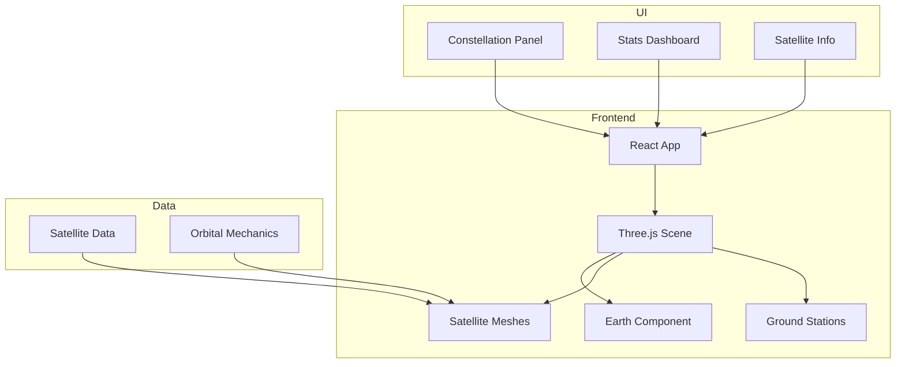

# Satellite Constellation Visualizer

3D orbital visualization of satellite constellations with coverage mapping and communication link analysis. Built for Space Domain Awareness applications.


## Live Demo

**[View Live Demo](https://ryanwelchtech.github.io/satellite-constellation-visualizer)**

## Features

- **3D Earth Visualization**: Interactive globe with realistic rendering
- **Multi-Constellation Support**: GPS, Starlink, SBIRS, WGS, NRO satellites
- **Real-time Orbital Animation**: Satellites orbit at realistic relative speeds
- **Satellite Details**: Click any satellite for orbital parameters and status
- **Ground Station Tracking**: Visualize global ground station network
- **Constellation Filtering**: Toggle visibility of different constellations
- **Coverage Statistics**: Real-time operational metrics

## Constellations

| Constellation | Type | Orbit | Purpose |
|--------------|------|-------|---------|
| GPS | Navigation | MEO | Global Positioning |
| Starlink | Communication | LEO | Broadband Internet |
| SBIRS | Military | GEO | Missile Warning |
| WGS | Military | GEO | Secure Communications |
| NRO | Reconnaissance | LEO | Intelligence |

## Architecture



## Tech Stack

| Technology | Purpose |
|------------|---------|
| React 18 | UI Framework |
| TypeScript | Type Safety |
| Three.js | 3D Graphics |
| React Three Fiber | React-Three.js Integration |
| React Three Drei | Three.js Helpers |
| Tailwind CSS | Styling |

## Quick Start

```bash
# Install dependencies
npm install

# Start development server
npm start

# Build for production
npm run build

# Deploy to GitHub Pages
npm run deploy
```

## Project Structure

```
satellite-constellation-visualizer/
├── src/
│   ├── components/
│   │   ├── Header.tsx
│   │   ├── StatsPanel.tsx
│   │   ├── ConstellationPanel.tsx
│   │   ├── SatelliteInfo.tsx
│   │   ├── Scene.tsx
│   │   ├── Earth.tsx
│   │   ├── SatelliteMesh.tsx
│   │   └── GroundStationMesh.tsx
│   ├── data/
│   │   └── satellites.ts
│   ├── types/
│   │   └── index.ts
│   ├── App.tsx
│   └── index.tsx
├── public/
└── package.json
```

## Controls

- **Drag**: Rotate view
- **Scroll**: Zoom in/out
- **Click Satellite**: View details
- **Toggle Eye Icon**: Show/hide constellation

## Space Domain Concepts

- Orbital mechanics visualization
- LEO/MEO/GEO orbit classification
- Ground station communication links
- Constellation architecture
- Space situational awareness

## Author

**Ryan Welch** - Cloud & Systems Security Engineer

## License

MIT License
